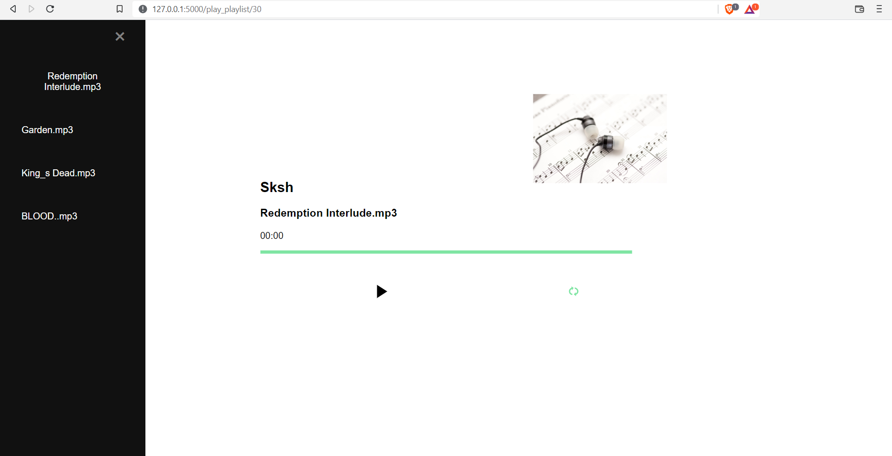

### Flask_Music_App

    Music Streaming App using Flask and Python that can be use to play music, manage playlists, Download songs,etc.
### Prerequisites
    Python 3.0 
    mysql
  
### Packages required:
    flask
    passlib
    flask_mail
    flask_mysqldb
    wtforms
    bs4
    youtube-dl(Install using 'sudo pip install --upgrade youtube-dl'  )
    Do "sudo pip install requests" also
    
### Installing Packages
    * Do pip install -r requirements.txt

### Import sql table
    * Create Database named as my_music in my_sql.
    * Create Tables as you can see from table.sql 
    * mysql -u root -p my_music < table.sql

### How to Run app:
    * Clone the repo to your local machine.
    * Install the above given packages.
    * Replace the app.config['MYSQL_PASSWORD']='Enter your sqlpassword'( line 21 in app.py) with your sql password.
    * Replace my Email and password in config.cfg with your Email and password where confirmation email is sent so you can login to the app.
    * If it gives an authentication error go to your email account and turn on for less secure app. Or create an App Password and use it.
    * Import the table.sql using above steps.
    * Then do python3 app.py.
    * open http://127.0.0.1:5000/ in Your local browser.
    
### Features
     * Login
     * Register and verify using Confirmation mail.
     * Play albums using music player.
     * Download any song of your choice from Search bar.
     * Create Private and public playlists.
     * See the other users Public playlists.
   
### Current Look
  

###### You can report any other issues also.
   
   
 
